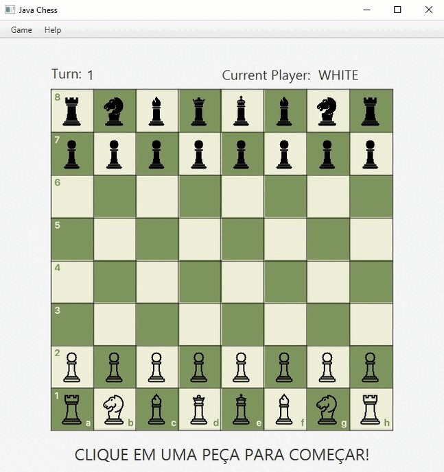

# Java Chess

A aplicação tem como proposta um jogo de xadrez virtual, atualmente offline e para dois jogadores. Pretendo continuar atualizando, incluindo telas dinamicas, motor para partidas solo e versão web.

## Sobre

Criado em Java, teve inicio como um dos projetos do curso "Java Completo - Nelio Alves" da Udemy, onde as regras foram implementadas e ao final a partida era realizada atráves do prompt. Tive a ideia de fazer um upgrade adicionando interface gráfica com a plataforma JavaFX, podendo assim exercitar e ganhar pratica com as tecnologias.

## Demonstração

